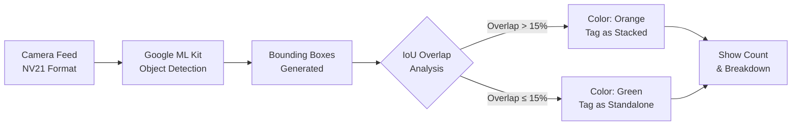

<div align="center">


### 🚀 Zero Server Costs • 🧠 On-Device ML • ⚡ Real-Time • 🔍 Smart Overlap Detection

[](https://github.com/virahitvin8/milk-tray-scan/actions)
[](https://github.com/virahitvin8/milk-tray-scan/releases/latest)
[](LICENSE)

<br/>

[📲 Download APK](https://github.com/virahitvin8/milk-tray-scan/releases/latest) · [🐛 Report Bug](https://github.com/virahitvin8/milk-tray-scan/issues) · [✨ Request Feature](https://github.com/virahitvin8/milk-tray-scan/issues)

</div>

---

## 🌟 About The Project

**Milk Tray Scan** is a highly optimized, fully free Android application built for shopkeepers and dairy distributors. By leveraging Google's ML Kit directly on your device, it detects and counts milk packets in real-time — **even when they are stacked or overlaid on a tray**.

No internet connection required. No APIs to pay for. Fully serverless.

### ✨ Key Features

- 📸 **Real-Time Detection:** Live camera feed with instant object detection
- 🤖 **On-Device AI:** Google ML Kit runs entirely on your phone — zero server costs
- 🟢🟠 **Smart Overlap Detection:** Uses Intersection over Union (IoU) analysis to identify stacked packets
  - **Green boxes** = standalone packets
  - **Orange boxes** = stacked/overlapping packets
- 📊 **Live Bounding Boxes & Count:** Visual overlays with real-time standalone vs. stacked breakdown
- 💾 **Capture & Save:** Take photos that are saved locally with overlap data
- 📋 **History Tracking:** Browse past sessions with image thumbnails, tap to zoom into saved photos
- 📈 **Stats Dashboard:** Home screen shows today, weekly, and all-time counting statistics
- 🔄 **Camera Switching:** Toggle between front and rear cameras
- 🌙 **Dark Mode:** Automatic dark/light theme based on system settings
- 🆓 **100% Free & Offline:** No subscriptions, no ads, no internet needed

---

## 🛠️ Built With

<div align="center">
  
  
  
  
  
</div>

---

## 📲 Installation

### Direct Download (Recommended)
1. Navigate to the [**Releases**](https://github.com/virahitvin8/milk-tray-scan/releases/latest) page.
2. Download `MilkTrayScan-v1.0.0.apk`.
3. Enable **"Install from unknown sources"** in your Android settings.
4. Install the app, grant camera permissions, and start counting!

### Build From Source
```bash
# Clone the repository
git clone https://github.com/virahitvin8/milk-tray-scan.git
cd milk-tray-scan

# Get dependencies
flutter pub get

# Build the release APK
flutter build apk --release
```

---

## 🧠 How The AI Works



1. **Camera captures** live video frames in NV21 format
2. **ML Kit processes** each frame for object detection on-device
3. **Filtering** removes noise (objects smaller than 1.5% of frame)
4. **IoU analysis** compares every pair of bounding boxes for overlap
5. **Color-coded boxes** are drawn: green for standalone, orange for stacked
6. **Count is displayed** in real-time with standalone vs. stacked breakdown
7. **Capture & Save** preserves the count with a photo to history

---

## 📱 Requirements

- Android 5.0 (Lollipop, API 21) or higher
- Camera hardware
- ~30 MB storage space

---

## 📁 Project Structure

```
lib/
├── main.dart                    # App entry point & routing
├── models/
│   └── count_record.dart        # Data model with overlap tracking
├── screens/
│   ├── home_screen.dart         # Stats dashboard & navigation
│   ├── camera_screen.dart       # Real-time detection with overlap analysis
│   └── history_screen.dart      # Records with image thumbnails
└── services/
    └── storage_service.dart     # Local persistence (singleton)
```

---

## 🤝 Contributing

Contributions are welcome! Feel free to open issues or submit pull requests.

1. Fork the Project
2. Create your Feature Branch (`git checkout -b feature/AmazingFeature`)
3. Commit your Changes (`git commit -m 'Add some AmazingFeature'`)
4. Push to the Branch (`git push origin feature/AmazingFeature`)
5. Open a Pull Request

---

## 📄 License

Distributed under the MIT License. See `LICENSE` for more information.

<div align="center">

**Made with ❤️ for dairy businesses across India**

*Powered by Flutter & Google ML Kit*

</div>
